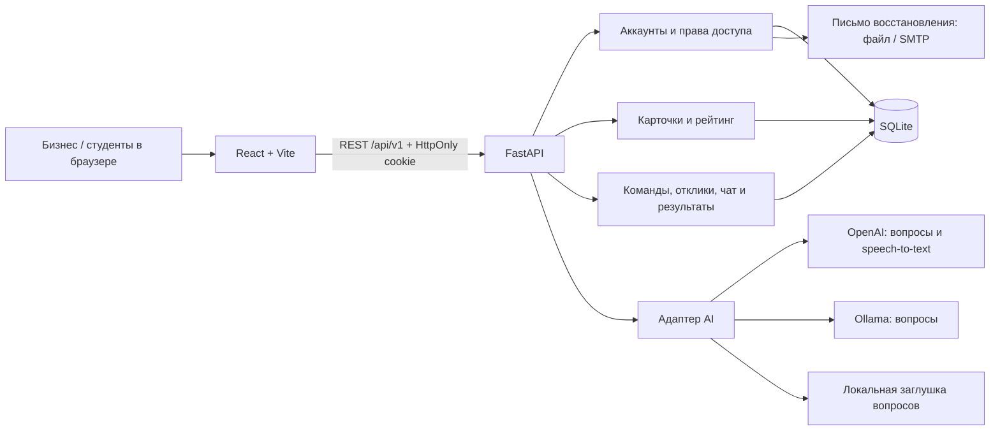

# 1. Tapsyrma — практические задачи AI Sana

TaskRank помогает бизнесу превратить идею в понятную задачу, а студентам — найти её,
собрать команду, предложить решение и сохранить подтверждённые результаты работы.
Это MVP для практического хакатона AI Sana с русским интерфейсом и отдельным backend API.

**Жюри: проект проверяется на вашем компьютере, деплой не требуется.**

1. Получите ветку `backend` через Git или ZIP и выполните команды для своей ОС в
   [разделе 7](#7-установка-и-запуск-по-шагам).
2. Оставьте стандартные настройки: настоящий backend, локальные вопросы `stub`,
   письма в файлах. Платные интеграции для основного сценария не нужны.
3. Откройте `http://127.0.0.1:5173` и пройдите
   [сценарий с ожидаемыми результатами](#8-воспроизводимый-сценарий-для-жюри).
4. Живую модель и распознавание голоса можно дополнительно проверить с собственным
   действующим OpenAI API-ключом по [разделу 9](#9-данные-и-интеграции).

## 2. Проблема и аудитория

Бизнес часто описывает задачу без данных, ограничений и критериев приёмки. Студентам
трудно понять объём работы, а обсуждения и результаты теряются в переписке.

Платформа предназначена для представителей бизнеса, которые публикуют практические
задачи, и студентов, которые выполняют их командами. Уточняющие вопросы помогают
дополнить карточку, прозрачный рейтинг показывает её готовность, а история сохраняет
решения и принятые результаты.

## 3. Что реализовано

- **Аккаунты:** регистрация бизнеса и студентов, вход, выход, серверные cookie-сессии
  и восстановление пароля по одноразовой ссылке. При регистрации и сбросе показана
  оценка пароля; сервер проверяет длину 15–128 символов и локальный список
  распространённых значений. Подробности — [политика паролей](backend/docs/password-policy.md).
- **Бизнес:** профиль компании, целей и ценностей; собственные карточки и история
  откликов, решений и результатов. Использование предыдущих задач в AI-контексте
  можно отключить отдельно от профиля.
- **Создание задачи:** текст или запись/загрузка аудио, уточняющие вопросы,
  несколько раундов ответов, редактор, сохранение, ручное подтверждение и публикация.
- **AI-помощник:** учитывает описание, категорию, критерии, ответы, предыдущие вопросы,
  профиль бизнеса и до пяти его прежних подтверждённых/опубликованных карточек.
  Генерирует 3–8 вопросов; при ошибке провайдера возвращает обозначенную заглушку.
- **Рейтинг:** 0–100 за подтверждённые поля, разбор по критериям и подсказки.
  Каталог открыт, публикация и отклики доступны при любом рейтинге.
  Доступны фильтры по теме и готовности; подбор для команды сопоставляет теги
  и навыки среди задач с рейтингом от 40, а не использует AI-ранжирование.
- **Студенты:** уникальный ID, телефон, несколько направлений работы и навыки;
  создание команды или вступление по названию и коду приглашения.
- **Команды:** один текущий состав на студента, максимум пять участников. Новые
  отклики отправляет лидер команды из 3–5 человек. Бизнес вручную принимает или
  отклоняет предложения, может выбрать несколько команд.
- **Общение:** контакт лидера виден владельцу задачи и текущим участникам команды;
  текстовый чат относится к конкретному отклику. После отказа чат доступен для чтения.
- **Результаты:** бизнес подтверждает прототип, пилот и передачу результата;
  начисляется 20, 30 и 50 XP соответственно. Личная история фиксирует состав на момент
  отклика и сохраняется после выхода студента из команды.

**Как считается рейтинг карточки:** сумма весов непустых полей, которые бизнес
подтвердил вручную. Максимум — 100 баллов; модель не назначает баллы.

| Критерий | Баллы |
| --- | --- |
| Контекст и потребность | 10 + 10 |
| Данные и материалы | 20 |
| Ожидаемый результат | 15 |
| Критерии успеха | 15 |
| Ограничения | 10 |
| Пользователи | 10 |
| Контакт и формат взаимодействия | 5 + 5 |

Уровни: **0–39 — «Черновик», 40–69 — «Рабочая», 70–89 — «Готовая»,
90–100 — «Приоритетная»**. Название и категория нужны для публикации, но баллов
не добавляют. До подтверждения интерфейс показывает возможный прирост.
Редактирование поля снимает его подтверждение; для новой публикации подтверждают
текущую редакцию. «Черновик» как уровень готовности не означает, что карточка приватна:
подтверждённая опубликованная задача с 0 баллов видна в общем каталоге.

## 4. Как работает пользовательский сценарий

1. Бизнес регистрируется и сохраняет профиль: деятельность, цели и ценности.
2. Описывает задачу, выбирает категорию; при настроенном OpenAI может продиктовать текст.
3. Отвечает на вопросы помощника и уточняет сведения в редакторе.
4. Сохраняет, подтверждает текущую редакцию и публикует карточку в каталоге.
5. Студенты регистрируются; лидер создаёт команду и приглашает ещё 2–4 участников.
6. Лидер отправляет идею, план, сроки и при необходимости ссылку на прототип.
7. Бизнес и команда обсуждают отклик. Решение о сотрудничестве принимает бизнес.
8. Бизнес подтверждает выполненные этапы. Командные XP и личная история отражают результат.

Изменения опубликованной карточки остаются приватными до повторной публикации.
Помощник не публикует задачи, не подтверждает факты и не выбирает команды.

## 5. Технологии, модели и API

| Часть | Используется |
| --- | --- |
| Frontend | React 18, TypeScript, React Router, Vite, собственные компоненты, CSS/Tailwind, lucide-react |
| Backend | Python 3.12+, FastAPI, Pydantic, SQLAlchemy 2, Uvicorn |
| Хранение | SQLite по умолчанию; аккаунты, сессии, карточки, команды, сообщения и результаты в БД |
| AI-вопросы | OpenAI Responses API, `gpt-4o-mini` по умолчанию; адаптер Ollama; локальный `stub` |
| Голос | Browser MediaRecorder / загрузка файла → OpenAI Audio Transcriptions, `gpt-4o-mini-transcribe` |
| Пароли | scrypt с индивидуальной солью; NFC; серверный индикатор zxcvbn 4.5.0 |
| Почта | Локальные `.eml` для демонстрации либо SMTP |
| Проверки | pytest, Ruff, TypeScript, Vitest, production-сборка Vite |

Основной REST API расположен под `/api/v1`. После запуска доступны
[Swagger](http://127.0.0.1:8000/docs) и [OpenAPI](http://127.0.0.1:8000/openapi.json).
Контракты описаны в [общем API](backend/docs/api.md),
[аккаунтах и истории](backend/docs/accounts-and-history.md),
[командах и чате](backend/docs/student-teams-and-chat.md).

## 6. Архитектура



| Каталог | Назначение |
| --- | --- |
| `frontend/src/pages`, `components` | Экраны, формы, голосовой ввод, чат |
| `frontend/src/api`, `context` | HTTP-клиент, сессия и состояние текущей команды |
| `backend/app/api` | REST-маршруты и проверка доступа |
| `backend/app/ai.py`, `business_profiles.py` | Подготовка контекста и AI-вопросов |
| `backend/app/tasks.py`, `rating.py` | Редакции, подтверждение, публикация и рейтинг |
| `backend/app/teams.py`, `proposals.py`, `chat_models.py` | Составы, предложения, этапы и сообщения |
| `backend/tests`, `frontend/src/**/*.test.ts` | Автоматические проверки |

Backend проверяет владельца карточки и роль пользователя для каждого закрытого
действия. Текущий состав команды определяет доступ к чату, а отдельный снимок состава
отклика — личную историю. Рейтинг вычисляется кодом по фиксированным весам.
Секреты интеграций хранятся только на backend. Подробнее —
[архитектура backend](backend/docs/architecture.md).

## 7. Установка и запуск по шагам

Нужны **Python 3.12+**, **Node.js 22+** и npm. Git нужен для клонирования и обновлений;
для ZIP он необязателен. Интернет нужен при установке зависимостей. После установки
основной сценарий со `stub` и локальной почтой работает без OpenAI и SMTP.
Хеширование пароля требует примерно 128 МиБ памяти на операцию, до двух одновременно.
Установка зависимостей и запуск из чистой копии проверены на Windows с Python 3.14
и Node.js 24. Команды для macOS/Linux приведены ниже, но на этих ОС отдельно не запускались.

### 7.1. Проверьте инструменты

В Windows откройте новое окно PowerShell:

```powershell
python --version
node --version
npm.cmd --version
git --version
```

В macOS/Linux:

```sh
python3 --version
node --version
npm --version
git --version
```

Если версия Python ниже 3.12 или Node.js ниже 22, сначала установите нужную версию.
После установки откройте терминал заново: старое окно может не увидеть изменения PATH.
В Windows вместо `python` можно использовать установленный Python Launcher `py -3`,
если он запускает Python 3.12+. Активировать venv и менять политику PowerShell не нужно:
ниже используются Python из `.venv` напрямую и `npm.cmd`.

### 7.2. Получите именно ветку backend

Репозиторий может быть закрытым: организатор должен предоставить вашей учётной записи
GitHub доступ. При ошибке 403 или «Repository not found» проверьте доступ и учётную запись.
Команды клонирования подходят для PowerShell и macOS/Linux:

```sh
git clone --branch backend https://github.com/BAITC-Hacks/hack-f2139e4f-whynot.git
cd hack-f2139e4f-whynot
```

**Вариант ZIP:** откройте [ветку backend](https://github.com/BAITC-Hacks/hack-f2139e4f-whynot/tree/backend),
выберите **Code → Download ZIP**, полностью распакуйте архив и откройте терминал
в папке, где рядом находятся `README.md`, `backend/` и `frontend/`.
Имя папки из ZIP может отличаться. Не запускайте проект внутри архива.
Далее «корень проекта» означает именно эту папку.

### 7.3. Windows: подготовка и два терминала

Из корня проекта:

```powershell
if (-not (Test-Path -LiteralPath .venv)) { python -m venv .venv }
.\.venv\Scripts\python.exe -m pip install -c backend/requirements.lock -e './backend[dev]'
if (-not (Test-Path -LiteralPath backend/.env)) { Copy-Item -LiteralPath backend/.env.example -Destination backend/.env }
if (-not (Test-Path -LiteralPath frontend/.env)) { Copy-Item -LiteralPath frontend/.env.example -Destination frontend/.env }
npm.cmd ci --prefix frontend
```

Существующие `.env` сохраняются. Проверьте настройки из 7.5, затем откройте
**два отдельных терминала из корня проекта**.

Терминал 1 — backend:

```powershell
Set-Location backend
..\.venv\Scripts\python.exe -m uvicorn app.main:app --reload --host 127.0.0.1 --port 8000
```

Терминал 2 — frontend:

```powershell
Set-Location frontend
npm.cmd run dev
```

### 7.4. macOS/Linux: подготовка и два терминала

Из корня проекта:

```sh
if [ ! -d .venv ]; then python3 -m venv .venv; fi
.venv/bin/python -m pip install -c backend/requirements.lock -e './backend[dev]'
if [ ! -f backend/.env ]; then cp backend/.env.example backend/.env; fi
if [ ! -f frontend/.env ]; then cp frontend/.env.example frontend/.env; fi
npm ci --prefix frontend
```

Проверьте настройки из 7.5. Откройте два терминала из корня проекта.

Терминал 1 — backend:

```sh
cd backend
../.venv/bin/python -m uvicorn app.main:app --reload --host 127.0.0.1 --port 8000
```

Терминал 2 — frontend:

```sh
cd frontend
npm run dev
```

### 7.5. Настройки для воспроизводимой локальной проверки

Проверьте эти значения в `backend/.env`; остальные параметры оставьте по шаблону.
Сам `.env.example` изменять для настройки приложения не нужно.

```dotenv
DATABASE_URL=sqlite:///./data/ai_sana.db
DEMO_MODE=false
COOKIE_SECURE=false
FRONTEND_URL=http://127.0.0.1:5173
CORS_ORIGINS=["http://127.0.0.1:5173","http://localhost:5173"]
AI_PROVIDER=stub
MAIL_MODE=file
MAIL_OUTBOX_DIR=data/outbox
```

В `frontend/.env`:

```dotenv
VITE_API_BASE_URL=/api/v1
VITE_USE_MOCKS=false
```

Откройте **[http://127.0.0.1:5173](http://127.0.0.1:5173)** и используйте этот адрес
для всей проверки, включая ссылку восстановления. Не переключайтесь между `localhost`
и `127.0.0.1`: для браузера это разные хосты с разными cookie.
Vite проксирует `/api` на `http://127.0.0.1:8000`; оба процесса должны работать.

[Проверка backend](http://127.0.0.1:8000/health) должна вернуть `status: "ok"`,
`ai_provider: "stub"`, `demo_mode: false`. `openai_configured` может быть `false`:
ключ не нужен для основной проверки. [Swagger](http://127.0.0.1:8000/docs) показывает
API; вход и закрытые действия удобнее проверять через UI, поскольку auth-запросы
требуют разрешённый Origin.

После изменения `.env` полностью перезапустите соответствующий сервер.
Backend читает `backend/.env`, однако относительные пути БД и почтовой папки зависят
от рабочей директории: запускайте backend из `backend`, как в командах выше.

### 7.6. Остановка, повторный запуск и обновление

Остановите оба сервера через **Ctrl+C** в их терминалах. Для следующего запуска
повторите только команды терминалов 1 и 2. Аккаунты, карточки и сообщения останутся в БД.

Для обновления клонированного проекта остановите серверы и из корня выполните:

```sh
git status --short
git switch backend
git pull --ff-only
```

Если есть собственные изменения или Git отказался выполнить fast-forward, сначала
сохраните и согласуйте эти изменения; не применяйте `reset --hard` ради обновления.
После успешного обновления переустановите зависимости. В Windows из корня:

```powershell
.\.venv\Scripts\python.exe -m pip install -c backend/requirements.lock -e './backend[dev]'
npm.cmd ci --prefix frontend
```

В macOS/Linux:

```sh
.venv/bin/python -m pip install -c backend/requirements.lock -e './backend[dev]'
npm ci --prefix frontend
```

Запустите оба сервера снова. **Не удаляйте `backend/data/` и свои `.env`:** обновление
кода не требует сбрасывать базу. Для ценных данных перед обновлением скопируйте
`backend/data/` в резервное место после остановки серверов.
В ZIP нет Git-истории: `git pull` недоступен; получите свежий архив отдельно и перенесите
свои настройки/данные, сохранив исходную копию.

### 7.7. Необязательные готовые данные

Для сценария ниже оставьте `DEMO_MODE=false` и создавайте свои аккаунты.
Если нужны готовые данные, установите `DEMO_MODE=true` в `backend/.env`, из `backend`
выполните `..\.venv\Scripts\python.exe -m app.seed` в Windows или
`../.venv/bin/python -m app.seed` в macOS/Linux и перезапустите backend.

Seed добавляет **5 черновиков, 5 опубликованных карточек, 5 команд по три участника
и 5 предложений**. Рейтинги опубликованных карточек: 20, 55, 80, 90, 100.
Повторный запуск не перезаписывает записи. Seed не создаёт пароли для UI; эти карточки
не принадлежат новым зарегистрированным аккаунтам. API-скрипт `scripts/demo.py`
также требует `DEMO_MODE=true`; [описание и команды](backend/README.md#демонстрационные-данные-и-api-сценарий).

### 7.8. Если запуск не получился

| Симптом | Что проверить |
| --- | --- |
| `python`, `node`, `npm` или `git` не найдены | Установите инструмент и откройте новый терминал. Проверьте версии из 7.1. В Windows для Python можно использовать `py -3`. |
| PowerShell запрещает `npm.ps1` | Используйте `npm.cmd`. Активация `.venv` через PowerShell не требуется. |
| `No module named uvicorn`, `fastapi` или `zxcvbn` | Установите зависимости из 7.3/7.4; запускайте Python именно из `.venv`. |
| В Linux недоступен `venv` | Установите пакет поддержки venv для вашей версии Python средствами своей ОС, затем повторите подготовку. |
| Порт 5173 или 8000 занят | Остановите старый процесс проекта через его Ctrl+C. Диагностика PowerShell: `Get-NetTCPConnection -State Listen -LocalPort 5173,8000`; не завершайте неизвестный процесс вслепую. |
| UI открыт, API недоступен | Проверьте `/health`, терминал backend и `VITE_API_BASE_URL=/api/v1`. Backend слушает 8000; после смены frontend `.env` перезапустите Vite. |
| После входа снова нужна авторизация | Для локального HTTP нужен `COOKIE_SECURE=false`. Приложение и письмо открывайте по одному хосту `127.0.0.1`. |
| `UNTRUSTED_ORIGIN`, CORS или auth в Swagger | Используйте UI на 5173. Проверьте `FRONTEND_URL`, JSON-массив `CORS_ORIGINS` и порт, затем перезапустите backend. |
| Демо-переключатель вместо регистрации | Установите `VITE_USE_MOCKS=false` и перезапустите frontend. Мок-режим не проверяет настоящий backend. |
| Пустой каталог | На новой базе это нормально. Опубликуйте карточку по разделу 8 или подключите необязательный seed. |
| Шаблонные вопросы или недоступен голос | Это ожидаемо со `stub`/без действующего ключа. Основной сценарий проходит текстом; интеграция — в разделе 9. |
| Нет письма на email | С `MAIL_MODE=file` оно находится в `backend/data/outbox/`. Для локальной проверки SMTP не нужен. |
| Ошибка 429 | Сработал лимит запросов. Дождитесь его окна; для индикатора пароля и чата — минута. |

## 8. Воспроизводимый сценарий для жюри

### 8.1. Подготовка аккаунтов

Проверяйте на `http://127.0.0.1:5173`, со стандартными `stub` и `MAIL_MODE=file`.
Понадобятся **четыре аккаунта: бизнес, лидер и два участника команды**. Придумайте
собственные уникальные пароли; общих «демо-паролей» для регистрации нет.
Можно по очереди выходить через **«Выйти»** и входить другим аккаунтом.
Для одновременной работы нужны отдельные профили/контейнеры браузера: обычные вкладки
одного профиля делят одну сессию. Перед пятиминутной демонстрацией подготовьте аккаунты.

| Экран | Адрес после `http://127.0.0.1:5173` |
| --- | --- |
| Регистрация / вход / восстановление | `/register`, `/login`, `/forgot-password` |
| Профиль бизнеса / свои карточки / история | `/business/profile`, `/business/tasks`, `/business/history` |
| Создание / редактор / публичная задача | `/new`, `/tasks/{id}/edit`, `/tasks/{id}` |
| Каталог / подбор для команды | `/catalog`, `/recommendations` |
| Профиль студента / команда / отклики | `/student/profile`, `/team/profile`, `/team/proposals` |
| Личная история / прогресс текущей команды | `/student/history`, `/team/progress` |

`{id}` — ID созданной карточки из адресной строки; придумывать его не нужно.

### 8.2. Полный путь: от идеи до результата

1. **Зарегистрируйте бизнес.** На `/register` выберите «Представитель бизнеса».
   Проверьте короткий пароль: индикатор показывает невыполненное требование длины.
   Затем используйте собственную фразу длиной 15–128 символов и совпадающее подтверждение.
   Кнопка **«Зарегистрироваться»** открывает аккаунт. На `/business/profile` сохраните
   цель «Сократить списания товаров» и ценность «Понятные решения для сотрудников».
   После обновления страницы профиль должен сохраниться.
2. **Создайте основную карточку.** На `/new` укажите название «Прогноз остатков»,
   категорию «Ритейл» и описание: «Закупщик каждый вечер вручную проверяет остатки.
   Хотим заранее понимать, что заканчивается, и сократить списания».
   Нажмите **«Перейти к уточнению»**. Ожидаются минимум три вопроса; при `stub`
   интерфейс обозначает локальную заглушку. Она разрешена условиями кейса.
3. **Уточните описание.** Ответьте о данных и результате, нажмите
   **«Уточнить с учётом ответов»**, затем **«Применить и открыть карточку»**.
   Заполните поля по таблице ниже, нажмите **«Сохранить»**, **«Подтвердить карточку»**,
   затем **«Опубликовать»**. После подтверждения полной карточки ожидается **100/100**.

| Поле | Демонстрационные сведения |
| --- | --- |
| Контекст | Закупщик вручную сверяет остатки каждый вечер. |
| Потребность | Сократить время проверки и уменьшить списания. |
| Пользователи | Закупщик учебного магазина. |
| Данные и материалы | Синтетические CSV продаж и остатков за шесть месяцев. |
| Ограничения | Две недели, Python, без персональных данных. |
| Ожидаемый результат | Прототип прогноза и отчёт с примером запуска. |
| Критерии успеха | Ошибка менее 15% на согласованной тестовой выборке. |
| Контакт | Учебный куратор: demo@example.com. |
| Формат взаимодействия | Созвон каждую неделю, ответы в течение двух дней. |

4. **Проверьте низкий рейтинг.** Создайте вторую задачу «Учебный черновик».
   На экране вопросов перейдите **«К редактору»**, оставьте название и категорию,
   а оцениваемые поля оставьте пустыми. Подтвердите и опубликуйте карточку.
   Ожидается **0/100**, но задача видна в каталоге. Фильтр готовности «Черновик · 0–39»
   показывает её. Верните «Все уровни», чтобы снова увидеть обе задачи.
5. **Проверьте приватность новой редакции.** В основной карточке измените название
   и сохраните, но не обновляйте публикацию. В публичной `/tasks/{id}` остаётся
   прежнее название. В редакторе подтвердите новую версию и нажмите
   **«Обновить публикацию»** — теперь каталог показывает изменённое название.
6. **Зарегистрируйте трёх студентов.** Для каждого выберите «Студент», укажите разные
   ID, email, телефон международного формата, направления и навыки. Можно выбрать
   несколько направлений и добавить своё. Профиль доступен на `/student/profile`;
   для проверки добавьте навык и нажмите **«Сохранить профиль»**.
7. **Соберите команду.** Лидер на `/team/profile` нажимает **«Создать команду»**,
   задаёт название и теги, например `retail` и `Python`. Сохраните код приглашения.
   Если код потерян, **«Создать новый код приглашения»** выдаёт новый; прежний перестаёт
   действовать. Второй и третий студенты выбирают **«Вступить по коду»**, вводят название
   и актуальный код, нажимают **«Присоединиться к команде»**. Лидер нажимает
   **«Обновить состав»**: ожидаются три участника и сообщение о готовности.
8. **Отправьте два отклика.** Лидер открывает каждую опубликованную задачу, заполняет
   идею, план и сроки и нажимает **«Отправить предложение»**. Отклик на карточку с 0 баллов
   тоже принимается. При составе меньше трёх отправка недоступна; у обычного участника
   кнопка отправки не заменяет роль лидера. На `/recommendations` основная карточка
   совпадает с тегом `retail`, а задача с 0 баллов остаётся только в общем каталоге.
9. **Проверьте обсуждение и контакт.** Студент открывает `/team/proposals` →
   **«Обсудить предложение»**, отправляет сообщение. Бизнес открывает «Мои задачи» →
   **«Отклики»** у нужной карточки и отвечает в обсуждении. Новое сообщение появляется
   в открытом чате после очередного опроса, обычно в пределах пяти секунд.
   **«Контакт лидера команды»** показывает телефон лидера; телефонов остальных
   участников в публичном каталоге и общем списке команд нет.
10. **Примите решение.** Для основной задачи бизнес нажимает **«Принять предложение»**.
    Для задачи с 0 баллов сначала оставьте сообщение, затем выберите **«Отклонить»**,
    добавьте комментарий и нажмите **«Подтвердить отказ»**. Студенты видят разные статусы
    и комментарий; отклонённое обсуждение сохраняется только для чтения.
11. **Подтвердите этапы.** У принятого предложения бизнес выбирает этап, заполняет
    **«Что вы проверили и приняли?»** и нажимает **«Подтвердить этап»**.
    Последовательно проверьте прототип, пилот и передачу результата:
    суммарные баллы новой команды составят **20 → 50 → 100 XP**.
    Уже подтверждённый этап исчезает из доступных вариантов и не начисляется повторно.
12. **Сверьте истории.** Бизнес на `/business/history` видит обе карточки, решения и
    результаты. Все три студента на `/student/history` видят свои отклики и принятые
    этапы. `/team/progress` показывает командные XP. Обновление браузера сохраняет данные.
13. **Проверьте выход участника.** Один обычный участник на `/team/profile` выбирает
    **«Выйти из команды»** → **«Подтвердить выход»**. Его `/student/history` остаётся;
    текущий командный чат становится недоступен. Командные XP остаются у команды.
    Выход лидера при наличии других участников или откликов не допускается.
14. **Проверьте восстановление** по пункту 8.3. Для дополнительной проверки изоляции
    можно зарегистрировать ещё один бизнес: чужие черновики, профиль и переписка
    не должны появляться в его кабинете.

### 8.3. Восстановление без SMTP

Выйдите из аккаунта, откройте `/forgot-password`, укажите его email и нажмите
**«Отправить ссылку»**. При `MAIL_MODE=file` письмо появляется в `backend/data/outbox/`,
на реальную почту ничего не отправляется. Откройте последний `.eml` почтовым клиентом
и перейдите по ссылке. Если почтового клиента нет, из `backend` в PowerShell можно
вывести декодированный текст последнего локального письма:

```powershell
..\.venv\Scripts\python.exe -c "from pathlib import Path; from email import policy; from email.parser import BytesParser; p=max(Path('data/outbox').glob('*.eml'), key=lambda f:f.stat().st_mtime); print(BytesParser(policy=policy.default).parsebytes(p.read_bytes()).get_body(preferencelist=('plain',)).get_content())"
```

В macOS/Linux та же команда использует `../.venv/bin/python`. Если файлов нет,
проверьте email существующего аккаунта, режим почты и рабочую папку backend.
Ссылка содержит одноразовый токен: открывайте её локально и не включайте в отчёт/скриншоты.

На странице нового пароля сначала проверьте несовпадающее подтверждение — форма
покажет ошибку. Затем задайте собственную новую фразу и нажмите **«Сохранить пароль»**.
Ожидаются переход ко входу, успешный вход новым паролем и отказ старому паролю.
Повторное использование ссылки не работает; срок действия — 30 минут.

### 8.4. Дополнительный чеклист функций и ошибок

| Проверка | Ожидаемый результат |
| --- | --- |
| Память бизнеса | Цели/ценности и флаг истории сохраняются после обновления. Живая модель получает их в контексте; `stub` не демонстрирует семантическую память. |
| Следующий AI-раунд | Введённые ответы сохраняются в карточке; модель в новом раунде учитывает ответы и предыдущие вопросы. У заглушки вопросы могут повторяться. |
| AI-контракт | `/api/v1/ai/contract` показывает промпт, пример входа, схемы запроса/ответа и правило fallback. |
| Голос без ключа | «Продиктовать описание» или «Загрузить аудио» показывает понятную ошибку распознавания; ручное описание доступно, карточка не теряется. |
| Голос с действующим OpenAI-ключом | Разрешите микрофон → «Завершить и распознать» → проверьте текст → «Добавить в описание». Текст можно отредактировать до добавления. |
| Отмена микрофона / неверный файл | Отмена завершает запись. Неподдерживаемый формат или файл больше 10 МиБ отклоняется; можно продолжить текстом. |
| Неверный OpenAI-ключ / отказ провайдера | Вопросы переходят на явно обозначенный `stub` с причиной; голос показывает ошибку. Это проверка обработки отказа, не успешная проверка LLM. |
| Локальный парольный индикатор | Короткий/распространённый пароль не проходит правила; длинная собственная фраза оценивается. Вставка и переключатель видимости доступны. |
| Потеря сети при оценке пароля | Индикатор показывает «Не проверен», а не зелёный успех; сервер проверит пароль при отправке формы. |
| Неверный пароль / повторный ID | Вход отклоняется, занятый ID не создаёт второй аккаунт; видна ошибка. |
| Неверное название или старый код команды | Вступление отклоняется; действующий код не раскрывается. |
| Максимум команды — расширенный тест | Начните с состава из трёх человек: при необходимости верните вышедшего участника по актуальному коду. Зарегистрируйте ещё троих: четвёртый и пятый вступают, шестой получает отказ. Один студент не может состоять сразу в двух командах. |
| Новый участник после отклика | Текущий чат доступен, но прошлые отклики команды не добавляются в его личную историю. |
| Чужая роль / выход | После «Выйти» закрытые страницы ведут ко входу; бизнес не получает интерфейс отправки студенческих откликов. |
| Фильтры / пустой результат / страницы | Тема и готовность фильтруют каталог; пустой результат объясняется, фильтры сбрасываются. Для пагинации добавьте больше девяти опубликованных задач. |
| Конфликт редактирования — расширенный тест | Откройте свой редактор в двух вкладках, сохраните разные правки. Устаревшая версия предлагает сравнение, а не молча заменяет новую. |
| Повторный запуск проекта | После Ctrl+C и запуска обоих серверов остаются аккаунты, карточки, сообщения, решения и XP. |

**Живые OpenAI/SMTP проверяйте только при наличии собственных действующих настроек.**
Наличие промокода или `openai_configured: true` не доказывает успешный запрос к модели.
Без настоящего ключа можно подтвердить основной сценарий и корректный fallback.

### 8.5. Показ за пять минут

Заранее запустите оба сервера, подготовьте четыре аккаунта, команду из трёх студентов,
отдельную опубликованную карточку на 0 баллов и текст для полей из таблицы в п. 8.2.
Основную задачу создайте во время показа из слабого описания: жюри должно увидеть
рост её рейтинга **0 → 100**. Сохраните свои данные входа отдельно.

| Время | Что показать |
| --- | --- |
| 0:00–0:40 | Проблема, профиль бизнеса и цели; создать основную задачу со слабым описанием и показать начальные 0 баллов. Указать AI-провайдера. |
| 0:40–1:40 | Получить вопросы, дополнить поля подготовленным текстом, сохранить и подтвердить: показать рост 0 → 100 и опубликовать. |
| 1:40–2:20 | Обе задачи в каталоге: 100 и 0 баллов, фильтры и доступность отклика. |
| 2:20–3:10 | Три участника, лидер отправляет предложение, контакт лидера и сообщение в чате. |
| 3:10–4:15 | Бизнес вручную принимает предложение и подтверждает этап: +20 XP. |
| 4:15–5:00 | История и результаты студента/бизнеса; честно назвать ограничения и локальный режим почты. |

### 8.6. Автоматические проверки

Из `backend` в Windows:

```powershell
..\.venv\Scripts\python.exe -m pytest -q
..\.venv\Scripts\python.exe -m ruff check .
..\.venv\Scripts\python.exe -m ruff format --check .
```

Из `frontend`:

```powershell
npm.cmd run typecheck
npm.cmd run test
npm.cmd run build
```

В macOS/Linux используйте `../.venv/bin/python` и `npm`. Тесты backend работают
с отдельными БД и блокируют реальные HTTP/SMTP-интеграции; они не отправляют письма
и не расходуют OpenAI-кредиты. Сборка не заменяет ручной сценарий в браузере.

## 9. Данные и интеграции

Основной сценарий жюри работает без внешних ключей и почтового сервиса:

| Возможность | Настройка | Что требуется |
| --- | --- | --- |
| Карточки, команды, чат, рейтинг и история | `AI_PROVIDER=stub`, `MAIL_MODE=file` | Только локальные backend, frontend и SQLite. |
| Уточняющие вопросы от OpenAI | `AI_PROVIDER=openai` | Действующий API-ключ и доступ к выбранной модели; промокод ключом не является. |
| Распознавание голоса | `OPENAI_API_KEY`, `OPENAI_TRANSCRIPTION_MODEL` | Действующий OpenAI-ключ; работает независимо от провайдера уточняющих вопросов. |
| Локальная модель для вопросов | `AI_PROVIDER=ollama` | Отдельно запущенный Ollama с установленной моделью. |
| Проверка восстановления пароля | `MAIL_MODE=file` | Письмо читается из `backend/data/outbox`; SMTP не нужен. |
| Настоящие письма | `MAIL_MODE=smtp` | Собственные настройки SMTP; конкретный почтовый провайдер не обязателен. |

По умолчанию данные сохраняются в `backend/data/ai_sana.db` при запуске из `backend`.
Локальные `.env`, БД, письма восстановления и артефакты сборки исключены из Git.
Правила `.gitignore` также закрывают `.env.production`, `.env.test` и другие
`.env.*`, SQLite-файлы, `.eml`, логи и приватные ключи. Из файлов окружения в Git
остаются только шаблоны `.env.example` с пустыми ключами; секреты на каждой машине
задаются отдельно.
Перед коммитом проверяйте `git diff --cached --stat`: не добавляйте приватные
файлы через `git add -f`. Для проверки истории можно использовать Gitleaks:
`gitleaks git --log-opts=--all --redact=100`. Проверка ищет известные признаки
секретов и не гарантирует обнаружение произвольных персональных данных.
Если настоящий ключ уже публиковался, его нужно отозвать у провайдера;
удаление файла следующим коммитом не убирает значение из истории.
Seed использует синтетические данные; ссылки `example.com` не являются готовыми
прототипами. История вопросов текущего раунда хранится на экране; после перезагрузки
доступны сохранённые поля карточки и серверная история задач.

**OpenAI подключается по желанию.** В существующем `backend/.env` задайте
`AI_PROVIDER=openai`, заполните `OPENAI_API_KEY` своим ключом. Настройки моделей:
`OPENAI_MODEL=gpt-4o-mini`, `OPENAI_TRANSCRIPTION_MODEL=gpt-4o-mini-transcribe`.
Перезапустите backend. Не помещайте ключ во frontend или переменные `VITE_*`.

API-ключ создаётся отдельно в [API keys](https://platform.openai.com/api-keys).
Промокод из раздела **Billing → Promotions** не заменяет API-ключ и не подходит
для `OPENAI_API_KEY`. Если у вас есть промокод на кредиты, активируйте его в панели
OpenAI, затем создайте API-ключ для проекта в нужной организации и сохраните только
ключ в локальном `backend/.env`. Создание ключа описано в
[официальной инструкции OpenAI](https://developers.openai.com/api/docs/quickstart).

Backend всегда читает `.env` именно из каталога `backend`, независимо от папки
запуска. Поддерживается UTF-8 с BOM из Windows-редакторов. Переменные окружения
процесса имеют приоритет над файлом; пустой `OPENAI_API_KEY` в окружении также
перекроет ключ из файла. Пробелы по краям ключа удаляются.

**Если ИИ или голос сообщает, что подключение не настроено:**

1. На машине, где запущен backend, откройте `backend/.env`: значение после
   `OPENAI_API_KEY=` должно быть заполнено; для вопросов выберите `AI_PROVIDER=openai`.
   `.env.example` служит только образцом. Ключ не попадает в Git: после клонирования
   репозитория на другую машину его нужно настроить там отдельно.
2. Остановите backend через `Ctrl+C` и запустите его снова командой из раздела 7.
   Изменение `.env` само по себе не обновляет настройки уже запущенного процесса.
3. Откройте [проверку backend](http://127.0.0.1:8000/health): должны быть
   `ai_provider: "openai"` и `openai_configured: true`. Поле `openai_configured`
   показывает только наличие загруженного ключа, не раскрывая его. Это ещё не
   проверка действительности ключа, доступа к модели или доступного лимита API.
4. Во frontend оставьте `VITE_USE_MOCKS=false` и `VITE_API_BASE_URL=/api/v1` при
   локальном запуске через Vite. Создайте задачу и запросите уточнения: в ответе
   `/assist` должен быть `provider: "openai"`. Затем загрузите короткую запись;
   успешный ответ `/ai/transcribe` содержит распознанный `text`.

Если ключ загружен, но запросы не проходят, проверьте его действительность, доступ
к указанным моделям и лимиты проекта OpenAI. Секрет должен оставаться на сервере:
[официальная документация OpenAI](https://developers.openai.com/api/docs/guides/production-best-practices).
Ответ OpenAI `401 invalid_api_key` означает, что провайдер не принимает переданный
ключ: замените его действующим ключом OpenAI и перезапустите backend. Само наличие
`openai_configured: true` не исключает такую ошибку; см.
[коды ошибок OpenAI](https://developers.openai.com/api/docs/guides/error-codes).

Вопросы отправляются через Responses API со структурированной JSON-схемой и
`store=false`. Провайдер получает текст текущей карточки, ответы и разрешённый
бизнес-контекст; контакты из прежних карточек в исторический контекст не включаются.
При распознавании провайдеру отправляется выбранная аудиозапись. Сервис не сохраняет
исходное аудио в своей БД. Голосу нужен OpenAI-ключ даже при `AI_PROVIDER=stub`;
без ключа описание можно ввести текстом. Успешный `/assist` содержит `provider=openai`;
`/health` показывает настройку провайдера и наличие ключа, а не результат обращения к модели.

Для локальных вопросов доступен Ollama: отдельно запустите его и укажите
`AI_PROVIDER=ollama`, `OLLAMA_BASE_URL`, `OLLAMA_MODEL`. Распознавание аудио этим
адаптером не выполняется.

**Почта:** `MAIL_MODE=file` сохраняет письма только на диске. Для настоящей отправки
укажите `MAIL_MODE=smtp`, параметры `SMTP_HOST`, `SMTP_PORT`, `SMTP_USERNAME`,
`SMTP_PASSWORD`, `SMTP_STARTTLS`, `MAIL_FROM` и правильный `FRONTEND_URL`.
Gmail не обязателен; [инструкция SMTP](backend/docs/student-teams-and-chat.md#почта-для-восстановления-пароля)
описывает подключение. SMTP и OpenAI требуют собственных действующих учётных данных.

**Проверка пароля** выполняется локальной библиотекой на backend. Пароль отправляется
из формы только серверу приложения; он не передаётся в AI, SMTP или стороннюю службу
проверки утечек. Сохраняется хеш, а не исходный пароль.

## 10. Ограничения и допущения

- Это локальный MVP. Публичное развёртывание требует HTTPS, `COOKIE_SECURE=true`,
  корректных `FRONTEND_URL`/CORS и настройки инфраструктуры.
- Нет MFA, подтверждения email или телефона. Оценка zxcvbn — подсказка, а локальный
  список паролей не является полной базой утечек. Соответствие стандартам целиком
  и абсолютная безопасность не заявляются.
- SQLite подходит для текущей демонстрации. Ограничения частоты запросов хранятся
  в памяти процесса; для нескольких серверов требуется общее хранилище лимитов.
  Новые таблицы создаются при старте; полноценный инструмент миграций не подключён.
- AI может ошибаться. Заглушка задаёт шаблонные вопросы, рейтинг проверяет наличие
  подтверждённых полей, а не достоверность сведений или качество решения.
- Студент состоит в одной текущей команде. Команды из одного-двух человек могут
  набирать участников, но новые отклики отправляют только составы из 3–5. Лидер
  не может выйти, оставив участников или отклики; передача лидерства не реализована.
- Личная история содержит состав на момент отклика. Для перенесённых старых откликов
  известен только прежний владелец команды. Командные XP остаются у команды.
- Чат текстовый, открытая переписка опрашивается каждые пять секунд; нет WebSocket,
  вложений, уведомлений о доставке и отдельного проектного трекера.
- Голосовой ввод зависит от браузера и разрешения микрофона; загрузка файла доступна
  отдельно. Максимальный размер аудио — 10 МиБ. Без настроенного OpenAI голос недоступен.
- По умолчанию письма не отправляются на email. Режим frontend `VITE_USE_MOCKS=true`
  хранит демонстрационные данные только в памяти вкладки и не заменяет проверку
  аккаунтов, команд, чата, истории и интеграций с настоящим backend.

## 11. Развёрнутая версия и ссылки

**Проект демонстрируется жюри локально.** Ссылка на
публичную deployed-версию отсутствует. Адреса ниже предназначены для локального запуска:

- [Интерфейс — http://127.0.0.1:5173](http://127.0.0.1:5173)
- [Swagger API — http://127.0.0.1:8000/docs](http://127.0.0.1:8000/docs)
- [Исходники, ветка backend](https://github.com/BAITC-Hacks/hack-f2139e4f-whynot/tree/backend)
- [README frontend](frontend/README.md) и [README backend](backend/README.md)
