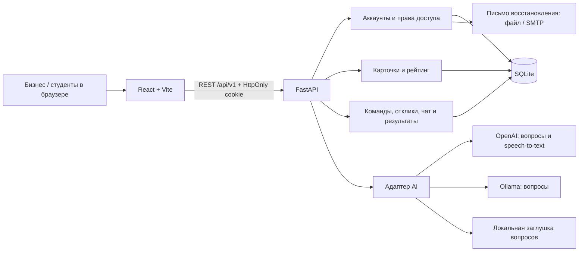

# 1. TaskRank — практические задачи AI Sana

TaskRank помогает бизнесу превратить идею в понятную задачу, а студентам — найти её,
собрать команду, предложить решение и сохранить подтверждённые результаты работы.
Это MVP для практического хакатона AI Sana с русским интерфейсом и отдельным backend API.

## 2. Проблема и аудитория

Бизнес часто описывает задачу без данных, ограничений и критериев приёмки. Студентам
трудно понять объём работы, а обсуждения и результаты теряются в переписке.

Платформа предназначена для представителей бизнеса, которые публикуют практические
задачи, и студентов, которые выполняют их командами. Уточняющие вопросы помогают
дополнить карточку, прозрачный рейтинг показывает её готовность, а история сохраняет
решения и принятые результаты.

## 3. Что реализовано

- **Аккаунты:** регистрация бизнеса и студентов, вход, выход, серверные cookie-сессии
  и восстановление пароля по одноразовой ссылке. При регистрации и сбросе показана
  оценка пароля; сервер проверяет длину 15–128 символов и локальный список
  распространённых значений. Подробности — [политика паролей](backend/docs/password-policy.md).
- **Бизнес:** профиль компании, целей и ценностей; собственные карточки и история
  откликов, решений и результатов. Использование предыдущих задач в AI-контексте
  можно отключить отдельно от профиля.
- **Создание задачи:** текст или запись/загрузка аудио, уточняющие вопросы,
  несколько раундов ответов, редактор, сохранение, ручное подтверждение и публикация.
- **AI-помощник:** учитывает описание, категорию, критерии, ответы, предыдущие вопросы,
  профиль бизнеса и до пяти его прежних подтверждённых/опубликованных карточек.
  Генерирует 3–8 вопросов; при ошибке провайдера возвращает обозначенную заглушку.
- **Рейтинг:** 0–100 за подтверждённые поля, разбор по критериям и подсказки.
  Каталог открыт, публикация и отклики доступны при любом рейтинге.
- **Студенты:** уникальный ID, телефон, несколько направлений работы и навыки;
  создание команды или вступление по названию и коду приглашения.
- **Команды:** один текущий состав на студента, максимум пять участников. Новые
  отклики отправляет лидер команды из 3–5 человек. Бизнес вручную принимает или
  отклоняет предложения, может выбрать несколько команд.
- **Общение:** контакт лидера виден владельцу задачи и текущим участникам команды;
  текстовый чат относится к конкретному отклику. После отказа чат доступен для чтения.
- **Результаты:** бизнес подтверждает прототип, пилот и передачу результата;
  начисляется 20, 30 и 50 XP соответственно. Личная история фиксирует состав на момент
  отклика и сохраняется после выхода студента из команды.

## 4. Как работает пользовательский сценарий

1. Бизнес регистрируется и сохраняет профиль: деятельность, цели и ценности.
2. Описывает задачу, выбирает категорию; при настроенном OpenAI может продиктовать текст.
3. Отвечает на вопросы помощника и уточняет сведения в редакторе.
4. Сохраняет, подтверждает текущую редакцию и публикует карточку в каталоге.
5. Студенты регистрируются; лидер создаёт команду и приглашает ещё 2–4 участников.
6. Лидер отправляет идею, план, сроки и при необходимости ссылку на прототип.
7. Бизнес и команда обсуждают отклик. Решение о сотрудничестве принимает бизнес.
8. Бизнес подтверждает выполненные этапы. Командные XP и личная история отражают результат.

Изменения опубликованной карточки остаются приватными до повторной публикации.
Помощник не публикует задачи, не подтверждает факты и не выбирает команды.

## 5. Технологии, модели и API

| Часть | Используется |
| --- | --- |
| Frontend | React 18, TypeScript, React Router, Vite, собственные компоненты, CSS/Tailwind, lucide-react |
| Backend | Python 3.12+, FastAPI, Pydantic, SQLAlchemy 2, Uvicorn |
| Хранение | SQLite по умолчанию; аккаунты, сессии, карточки, команды, сообщения и результаты в БД |
| AI-вопросы | OpenAI Responses API, `gpt-4o-mini` по умолчанию; адаптер Ollama; локальный `stub` |
| Голос | Browser MediaRecorder / загрузка файла → OpenAI Audio Transcriptions, `gpt-4o-mini-transcribe` |
| Пароли | scrypt с индивидуальной солью; NFC; серверный индикатор zxcvbn 4.5.0 |
| Почта | Локальные `.eml` для демонстрации либо SMTP |
| Проверки | pytest, Ruff, TypeScript, Vitest, production-сборка Vite |

Основной REST API расположен под `/api/v1`. После запуска доступны
[Swagger](http://127.0.0.1:8000/docs) и [OpenAPI](http://127.0.0.1:8000/openapi.json).
Контракты описаны в [общем API](backend/docs/api.md),
[аккаунтах и истории](backend/docs/accounts-and-history.md),
[командах и чате](backend/docs/student-teams-and-chat.md).

## 6. Архитектура



| Каталог | Назначение |
| --- | --- |
| `frontend/src/pages`, `components` | Экраны, формы, голосовой ввод, чат |
| `frontend/src/api`, `context` | HTTP-клиент, сессия и состояние текущей команды |
| `backend/app/api` | REST-маршруты и проверка доступа |
| `backend/app/ai.py`, `business_profiles.py` | Подготовка контекста и AI-вопросов |
| `backend/app/tasks.py`, `rating.py` | Редакции, подтверждение, публикация и рейтинг |
| `backend/app/teams.py`, `proposals.py`, `chat_models.py` | Составы, предложения, этапы и сообщения |
| `backend/tests`, `frontend/src/**/*.test.ts` | Автоматические проверки |

Backend проверяет владельца карточки и роль пользователя для каждого закрытого
действия. Текущий состав команды определяет доступ к чату, а отдельный снимок состава
отклика — личную историю. Рейтинг вычисляется кодом по фиксированным весам.
Секреты интеграций хранятся только на backend. Подробнее —
[архитектура backend](backend/docs/architecture.md).

## 7. Установка и запуск по шагам

Нужны Git, **Python 3.12+**, **Node.js 22+** и npm. Для установки зависимостей нужен
интернет. OpenAI и SMTP для основного локального сценария не обязательны.
Парольное хеширование использует примерно 128 МиБ на операцию; одновременно
выполняется не более двух таких операций на процесс.

**Получите проект.** Реализация находится в ветке `backend`; для закрытого репозитория
нужен доступ вашей учётной записи GitHub. Можно также распаковать архив этой ветки.

```powershell
git clone --branch backend https://github.com/BAITC-Hacks/hack-f2139e4f-whynot.git
Set-Location hack-f2139e4f-whynot
```

**Windows / PowerShell — подготовка из корня репозитория:**

```powershell
if (-not (Test-Path -LiteralPath .venv)) { python -m venv .venv }
.\.venv\Scripts\python.exe -m pip install -c backend/requirements.lock -e './backend[dev]'
if (-not (Test-Path -LiteralPath backend/.env)) { Copy-Item -LiteralPath backend/.env.example -Destination backend/.env }
if (-not (Test-Path -LiteralPath frontend/.env)) { Copy-Item -LiteralPath frontend/.env.example -Destination frontend/.env }
```

Команды сохраняют уже существующие `.env`. В стандартной конфигурации backend:
`DEMO_MODE=false`, `AI_PROVIDER=stub`, `MAIL_MODE=file`; во frontend:
`VITE_API_BASE_URL=/api/v1`, `VITE_USE_MOCKS=false`.
Если файлы настроек были созданы раньше, проверьте эти значения вручную.

**Терминал 1 — backend, начиная из корня:**

```powershell
Set-Location backend
..\.venv\Scripts\python.exe -m uvicorn app.main:app --reload --host 127.0.0.1 --port 8000
```

**Терминал 2 — frontend, начиная из корня:**

```powershell
Set-Location frontend
npm.cmd ci
npm.cmd run dev
```

Откройте [приложение](http://127.0.0.1:5173).
[Проверка backend](http://127.0.0.1:8000/health) должна вернуть `status: "ok"`.
Vite проксирует `/api` на backend; оба процесса должны оставаться запущенными.
Порт frontend фиксирован: если 5173 занят, освободите его или согласованно измените
порт, `FRONTEND_URL` и `CORS_ORIGINS`.

**macOS / Linux — подготовка из корня:**

```sh
if [ ! -d .venv ]; then python3 -m venv .venv; fi
.venv/bin/python -m pip install -c backend/requirements.lock -e './backend[dev]'
if [ ! -f backend/.env ]; then cp backend/.env.example backend/.env; fi
if [ ! -f frontend/.env ]; then cp frontend/.env.example frontend/.env; fi
```

В первом терминале перейдите в `backend` и запустите
`../.venv/bin/python -m uvicorn app.main:app --reload --host 127.0.0.1 --port 8000`.
Во втором перейдите в `frontend`, выполните `npm ci`, затем `npm run dev`.

**Необязательные демонстрационные данные.** В `backend/.env` установите
`DEMO_MODE=true`, из `backend` выполните команду ниже и перезапустите backend:

```powershell
..\.venv\Scripts\python.exe -m app.seed
```

Seed добавляет синтетические карточки разной готовности и команды по три участника.
Повторный запуск не перезаписывает эти записи. Новым зарегистрированным аккаунтам
они не принадлежат; для собственного сценария создавайте свои карточки и команду.
Демо-скрипт `..\.venv\Scripts\python.exe scripts/demo.py` из `backend` требует
`DEMO_MODE=true`. Обычной регистрации этот режим не нужен.

**Проверки:** из `backend` выполните:

```powershell
..\.venv\Scripts\python.exe -m pytest -q
..\.venv\Scripts\python.exe -m ruff check .
..\.venv\Scripts\python.exe -m ruff format --check .
```

Из `frontend`:

```powershell
npm.cmd run typecheck
npm.cmd run test
npm.cmd run build
```

В macOS/Linux замените путь Python на `../.venv/bin/python`, а `npm.cmd` — на `npm`.
Тесты backend используют отдельные базы. Автоматические проверки не подтверждают
качество ответов живой модели и не заменяют следующий сценарий в браузере.

## 8. Воспроизводимый сценарий для жюри

Достаточно локального запуска со стандартным `stub`. Для полного пути нужны
**четыре аккаунта: один бизнес и три студента**. В одном браузере последовательно
выходите и входите нужным аккаунтом; для одновременного просмотра используйте разные
профили браузера. Для каждого аккаунта придумайте собственный пароль или парольную
фразу; готовые пароли из документации использовать не нужно.

1. **Аккаунт и профиль бизнеса.** На `/register` выберите бизнес. Проверьте индикатор
   пароля: короткое значение не проходит проверку; длинная уникальная фраза получает
   оценку и подсказки. Сохраните профиль: цель «Сократить списания товаров», ценность
   «Понятные решения для сотрудников».
2. **Создание карточки.** Укажите название «Прогноз остатков», категорию «Ритейл» и
   описание: «Закупщик каждый вечер вручную проверяет остатки. Хотим заранее понимать,
   что заканчивается, и сократить списания». Нажмите **«Перейти к уточнению»**.
   Должны появиться минимум три вопроса и указание используемого провайдера.
3. **Уточнение.** Ответьте о данных и результате. Нажмите **«Уточнить с учётом ответов»**,
   затем **«Применить и открыть карточку»**. В редакторе заполните демонстрационные
   сведения из таблицы ниже. После **«Подтвердить карточку»** рейтинг полной карточки
   составит **100/100**; опубликуйте её и найдите в каталоге.

| Поле карточки | Сведения для демонстрации |
| --- | --- |
| Контекст | Закупщик вручную сверяет остатки каждый вечер. |
| Потребность | Сократить время проверки и уменьшить списания. |
| Пользователи | Закупщик учебного магазина. |
| Данные и материалы | Синтетические CSV продаж и остатков за шесть месяцев. |
| Ограничения | Две недели, Python, без персональных данных. |
| Ожидаемый результат | Прототип прогноза и отчёт с примером запуска. |
| Критерии успеха | Ошибка прогноза менее 15% на согласованной тестовой выборке. |
| Контакт | Учебный куратор: demo@example.com. |
| Формат взаимодействия | Еженедельный созвон, ответы на вопросы в течение двух дней. |

4. **Команда.** Зарегистрируйте трёх студентов с разными ID, телефонами, направлениями
   и навыками. Первый создаёт команду и получает код. Остальные входят по названию и
   коду. До третьего участника отправка нового отклика недоступна; после вступления
   трёх команда готова, а отправка доступна лидеру.
5. **Отклик и обсуждение.** Лидер открывает опубликованную задачу и отправляет идею,
   план и сроки. Любой текущий участник открывает обсуждение и пишет сообщение.
   Бизнес в откликах задачи видит сообщение, контакт лидера и может ответить.
6. **Решение и результат.** Бизнес принимает предложение и подтверждает «Прототип»,
   описав проверенный результат. Команда получает **20 XP**. Каждый из трёх студентов
   видит решение и результат в **«Мои задачи и результаты»**. Повторное подтверждение
   того же этапа не начисляет XP повторно.
7. **Сохранность истории.** Один из участников, кроме лидера, выходит из команды.
   Его личная история остаётся; доступ к командной переписке прекращается. Вступивший
   позднее участник получает доступ к текущему чату, но не чужие прошлые работы в своей истории.
8. **Восстановление пароля.** Выйдите, запросите восстановление для своего аккаунта.
   При `MAIL_MODE=file` откройте последнее письмо `.eml` в `backend/data/outbox/`,
   перейдите по ссылке и задайте новый пароль. Ссылка одноразовая, действует 30 минут.
   После успешного изменения войдите заново; старые сессии завершаются.

Дополнительно с настроенным OpenAI: продиктуйте описание, проверьте распознанный текст
до добавления и сравните вопросы для ритейла, образования и логистики. Для проверки
памяти создайте вторую задачу того же бизнеса. В режиме `stub` семантическая
персонализация вопросов не демонстрируется.

## 9. Данные и интеграции

По умолчанию данные сохраняются в `backend/data/ai_sana.db` при запуске из `backend`.
Локальные `.env`, БД, письма восстановления и артефакты сборки исключены из Git.
Правила `.gitignore` также закрывают `.env.production`, `.env.test` и другие
`.env.*`, SQLite-файлы, `.eml`, логи и приватные ключи. Из файлов окружения в Git
остаются только шаблоны `.env.example` с пустыми ключами; секреты на каждой машине
задаются отдельно.
Перед коммитом проверяйте `git diff --cached --stat`: не добавляйте приватные
файлы через `git add -f`. Для проверки истории можно использовать Gitleaks:
`gitleaks git --log-opts=--all --redact=100`. Проверка ищет известные признаки
секретов и не гарантирует обнаружение произвольных персональных данных.
Если настоящий ключ уже публиковался, его нужно отозвать у провайдера;
удаление файла следующим коммитом не убирает значение из истории.
Seed использует синтетические данные; ссылки `example.com` не являются готовыми
прототипами. История вопросов текущего раунда хранится на экране; после перезагрузки
доступны сохранённые поля карточки и серверная история задач.

**OpenAI подключается по желанию.** В существующем `backend/.env` задайте
`AI_PROVIDER=openai`, заполните `OPENAI_API_KEY` своим ключом. Настройки моделей:
`OPENAI_MODEL=gpt-4o-mini`, `OPENAI_TRANSCRIPTION_MODEL=gpt-4o-mini-transcribe`.
Перезапустите backend. Не помещайте ключ во frontend или переменные `VITE_*`.

API-ключ создаётся отдельно в [API keys](https://platform.openai.com/api-keys).
Промокод из раздела **Billing → Promotions** не заменяет API-ключ и не подходит
для `OPENAI_API_KEY`. Если у вас есть промокод на кредиты, активируйте его в панели
OpenAI, затем создайте API-ключ для проекта в нужной организации и сохраните только
ключ в локальном `backend/.env`. Создание ключа описано в
[официальной инструкции OpenAI](https://developers.openai.com/api/docs/quickstart).

Backend всегда читает `.env` именно из каталога `backend`, независимо от папки
запуска. Поддерживается UTF-8 с BOM из Windows-редакторов. Переменные окружения
процесса имеют приоритет над файлом; пустой `OPENAI_API_KEY` в окружении также
перекроет ключ из файла. Пробелы по краям ключа удаляются.

**Если ИИ или голос сообщает, что подключение не настроено:**

1. На машине, где запущен backend, откройте `backend/.env`: значение после
   `OPENAI_API_KEY=` должно быть заполнено; для вопросов выберите `AI_PROVIDER=openai`.
   `.env.example` служит только образцом. Ключ не попадает в Git: после клонирования
   репозитория на другую машину его нужно настроить там отдельно.
2. Остановите backend через `Ctrl+C` и запустите его снова командой из раздела 7.
   Изменение `.env` само по себе не обновляет настройки уже запущенного процесса.
3. Откройте [проверку backend](http://127.0.0.1:8000/health): должны быть
   `ai_provider: "openai"` и `openai_configured: true`. Поле `openai_configured`
   показывает только наличие загруженного ключа, не раскрывая его. Это ещё не
   проверка действительности ключа, доступа к модели или доступного лимита API.
4. Во frontend оставьте `VITE_USE_MOCKS=false` и `VITE_API_BASE_URL=/api/v1` при
   локальном запуске через Vite. Создайте задачу и запросите уточнения: в ответе
   `/assist` должен быть `provider: "openai"`. Затем загрузите короткую запись;
   успешный ответ `/ai/transcribe` содержит распознанный `text`.

Если ключ загружен, но запросы не проходят, проверьте его действительность, доступ
к указанным моделям и лимиты проекта OpenAI. Секрет должен оставаться на сервере:
[официальная документация OpenAI](https://developers.openai.com/api/docs/guides/production-best-practices).
Ответ OpenAI `401 invalid_api_key` означает, что провайдер не принимает переданный
ключ: замените его действующим ключом OpenAI и перезапустите backend. Само наличие
`openai_configured: true` не исключает такую ошибку; см.
[коды ошибок OpenAI](https://developers.openai.com/api/docs/guides/error-codes).

Вопросы отправляются через Responses API со структурированной JSON-схемой и
`store=false`. Провайдер получает текст текущей карточки, ответы и разрешённый
бизнес-контекст; контакты из прежних карточек в исторический контекст не включаются.
При распознавании провайдеру отправляется выбранная аудиозапись. Сервис не сохраняет
исходное аудио в своей БД. Голосу нужен OpenAI-ключ даже при `AI_PROVIDER=stub`;
без ключа описание можно ввести текстом. Успешный `/assist` содержит `provider=openai`;
`/health` показывает настройку провайдера и наличие ключа, а не результат обращения к модели.

Для локальных вопросов доступен Ollama: отдельно запустите его и укажите
`AI_PROVIDER=ollama`, `OLLAMA_BASE_URL`, `OLLAMA_MODEL`. Распознавание аудио этим
адаптером не выполняется.

**Почта:** `MAIL_MODE=file` сохраняет письма только на диске. Для настоящей отправки
укажите `MAIL_MODE=smtp`, параметры `SMTP_HOST`, `SMTP_PORT`, `SMTP_USERNAME`,
`SMTP_PASSWORD`, `SMTP_STARTTLS`, `MAIL_FROM` и правильный `FRONTEND_URL`.
Gmail не обязателен; [инструкция SMTP](backend/docs/student-teams-and-chat.md#почта-для-восстановления-пароля)
описывает подключение. SMTP и OpenAI требуют собственных действующих учётных данных.

**Проверка пароля** выполняется локальной библиотекой на backend. Пароль отправляется
из формы только серверу приложения; он не передаётся в AI, SMTP или стороннюю службу
проверки утечек. Сохраняется хеш, а не исходный пароль.

## 10. Ограничения и допущения

- Это локальный MVP. Публичное развёртывание требует HTTPS, `COOKIE_SECURE=true`,
  корректных `FRONTEND_URL`/CORS и настройки инфраструктуры.
- Нет MFA, подтверждения email или телефона. Оценка zxcvbn — подсказка, а локальный
  список паролей не является полной базой утечек. Соответствие стандартам целиком
  и абсолютная безопасность не заявляются.
- SQLite подходит для текущей демонстрации. Ограничения частоты запросов хранятся
  в памяти процесса; для нескольких серверов требуется общее хранилище лимитов.
  Новые таблицы создаются при старте; полноценный инструмент миграций не подключён.
- AI может ошибаться. Заглушка задаёт шаблонные вопросы, рейтинг проверяет наличие
  подтверждённых полей, а не достоверность сведений или качество решения.
- Студент состоит в одной текущей команде. Команды из одного-двух человек могут
  набирать участников, но новые отклики отправляют только составы из 3–5. Лидер
  не может выйти, оставив участников или отклики; передача лидерства не реализована.
- Личная история содержит состав на момент отклика. Для перенесённых старых откликов
  известен только прежний владелец команды. Командные XP остаются у команды.
- Чат текстовый, открытая переписка опрашивается каждые пять секунд; нет WebSocket,
  вложений, уведомлений о доставке и отдельного проектного трекера.
- Голосовой ввод зависит от браузера и разрешения микрофона; загрузка файла доступна
  отдельно. Максимальный размер аудио — 10 МиБ. Без настроенного OpenAI голос недоступен.
- По умолчанию письма не отправляются на email. Режим frontend `VITE_USE_MOCKS=true`
  хранит демонстрационные данные только в памяти вкладки и не заменяет проверку
  аккаунтов, команд, чата, истории и интеграций с настоящим backend.

## 11. Развёрнутая версия и ссылки

**Ссылка на публичную deployed-версию не указана.** В репозитории нет подтверждённого
адреса публичного приложения. Адреса ниже предназначены для локального запуска:

- [Интерфейс — http://127.0.0.1:5173](http://127.0.0.1:5173)
- [Swagger API — http://127.0.0.1:8000/docs](http://127.0.0.1:8000/docs)
- [Исходники, ветка backend](https://github.com/BAITC-Hacks/hack-f2139e4f-whynot/tree/backend)
- [README frontend](frontend/README.md) и [README backend](backend/README.md)
