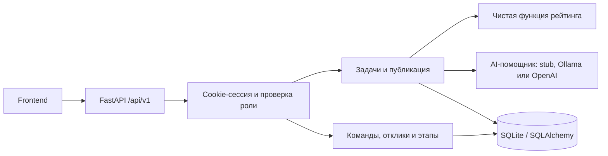
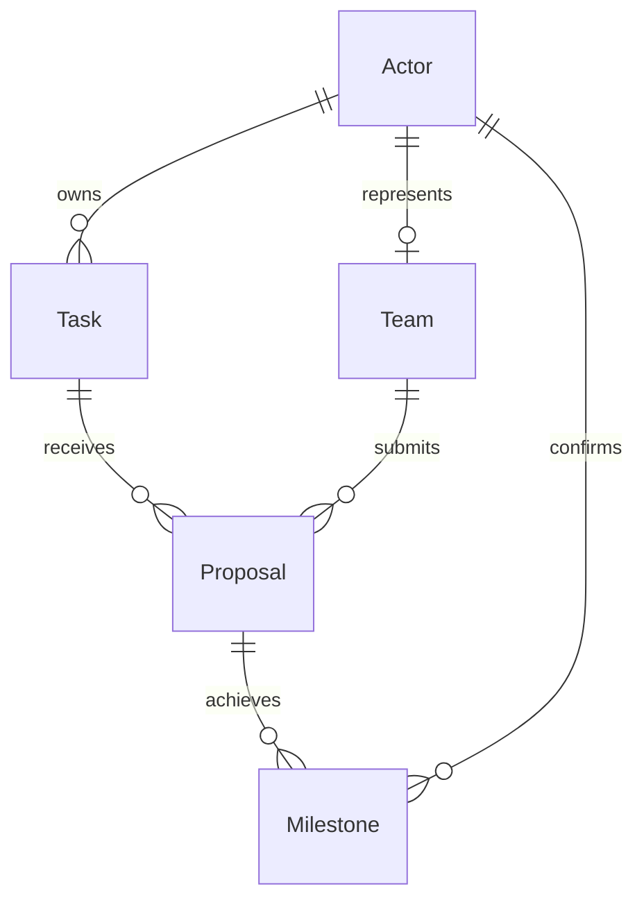

# Архитектура backend

## Идея продукта

Бизнес видит прогресс заполнения, доступный прирост баллов по каждому полю и более высокую
позицию после подтверждённого улучшения карточки. Студенты видят весь опубликованный
каталог и сами откликаются. AI помогает задавать вопросы; рейтинг и решения контролируются
обычной бизнес-логикой и пользователем.

Варианты развития геймификации: подсказка «добавьте данные: +20», индикатор до следующего
уровня, выделение приоритетных карточек, баллы команд за подтверждённые результаты.
Основа для этих интерфейсов уже возвращается API.

## Выбор стека

| Вариант | Когда подходит | Решение для MVP |
| --- | --- | --- |
| FastAPI + SQLite | Быстрый запуск, Python, автоматический контракт API | Реализован |
| FastAPI + PostgreSQL | Общий сервер и больше одновременных изменений | Следующий этап с миграциями |
| Node.js + TypeScript | Команда заранее согласовала общий язык с frontend | Альтернатива до интеграции |

Один модульный сервис проще запустить за 5 часов. Очереди и отдельные сервисы пока не нужны.
Роутеры организованы по [официальному подходу FastAPI](https://fastapi.tiangolo.com/tutorial/bigger-applications/).
Для SQLite явно включены внешние ключи согласно
[документации SQLAlchemy](https://docs.sqlalchemy.org/en/20/dialects/sqlite.html#foreign-key-support).



## Модули

```text
backend/
  app/
    main.py             сборка приложения, CORS, единые ошибки
    config.py           настройки из окружения / .env
    db.py               соединения и сессии
    models.py           таблицы и ограничения БД
    schemas.py          входные и выходные контракты Pydantic
    rating.py           формула 0–100 без HTTP и БД
    tasks.py            версии карточки, подтверждение, каталог
    proposals.py        ручные решения и баллы этапов
    ai.py               промпт, адаптер Ollama, валидация и fallback
    seed.py             синтетические данные
    api/                HTTP-роутеры и зависимости доступа
  tests/                бизнес-правила и сквозной API-сценарий
  scripts/demo.py        демонстрация через настоящий HTTP
```

## Данные



`Task` хранит исходный текст, текущую карточку JSON, подтверждённые поля, номер редакции
и отдельный опубликованный снимок. Балл и тема опубликованной версии вынесены в
индексируемые столбцы для каталога. `Proposal` ссылается на задачу и команду;
единственного `selected_team_id` нет — бизнес может выбрать несколько команд.

`StudentProfile` хранит уникальный нормализованный ID, контакт и профессиональные
навыки. `Team.owner_id` — лидер; `TeamMembership` связывает студента с одной командой.
Уникальные позиции 1–5 ограничивают состав и при параллельных вступлениях.
`TeamInvite` хранит хеш приглашения. Состав `ProposalParticipant` фиксируется при
отклике и сохраняет личную историю после выхода. `ChatMessage` содержит текстовую
переписку отклика; доступ проверяется по владельцу задачи и текущему составу команды.
Контакты и личные ID не участвуют в рейтинге или AI-контексте.

В `Milestone` действует уникальность `(proposal_id, code)`. Баллы команды вычисляются
суммой подтверждённых этапов. Повтор одинакового запроса не начисляет баллы ещё раз.
За сам отклик или принятие предложения баллы не выдаются.

## Версии и подтверждение

1. Создание: приватный черновик, `revision=1`, рейтинг 0.
2. `/assist`: предложение карточки и минимум 3 вопроса; запись не изменяется.
3. `PUT /card`: полная замена текущей карточки; при изменении `revision` увеличивается.
   У изменённых полей снимается подтверждение. Подтверждения неизменённых полей сохраняются.
4. `/confirm`: бизнес подтверждает все непустые поля текущей редакции; балл пересчитывается.
5. `/publish`: только подтверждённая текущая редакция копируется в публичный снимок.
6. После новых правок каталог показывает прежний снимок до повторных `/confirm` и `/publish`.

`expected_revision` защищает от сохранения старой формы. Дополнительно SQLAlchemy
проверяет `lock_version` при конкурентных изменениях задач и решений. Конфликт возвращает 409.
`status=draft` означает неопубликованную задачу; `readiness=draft` означает рейтинг 0–39
и может относиться к уже опубликованной задаче. Frontend должен различать эти понятия.

## Формула рейтинга

Для каждого поля: `баллы = вес`, если оно непустое и подтверждено; иначе `0`.
Пробелы по краям удаляются до проверки. `preview_score` показывает возможную сумму
после подтверждения всех текущих полей и не влияет на каталог.

| Критерий | Поля | Вес |
| --- | --- | ---: |
| Контекст и потребность | `context` + `need` | 10 + 10 |
| Данные | `data` | 20 |
| Результат | `expected_result` | 15 |
| Приёмка | `success_criteria` | 15 |
| Ограничения | `constraints` | 10 |
| Пользователи | `users` | 10 |
| Связь | `contact` + `interaction_format` | 5 + 5 |

Уровни: 0–39 `draft`, 40–69 `working`, 70–89 `ready`, 90–100 `priority`.
Название и тема нужны для публикации, но баллов не дают. Низкий балл, включая 0,
не скрывает опубликованную задачу и не запрещает отклики.

Каталог сортируется по баллу убывающе, затем по времени публикации убывающе и ID.
Фильтры по точной теме и уровню применяются только по выбору пользователя.
Никаких скрытых фильтров по команде или лимита на количество откликов нет.

## Решение бизнеса и прогресс

`pending → accepted` или `pending → rejected`, только по действию владельца задачи.
В MVP решения окончательные; повтор того же решения допустим. Каждое предложение
обрабатывается независимо. Подтверждённые бизнесом этапы принятого предложения:
`prototype` = 20, `pilot` = 30, `delivery` = 50. Текст `evidence` описывает проверенный результат.
Этапы добавлены как минимальное продолжение сценария, без полноценного трекера проектов.

## Следующие шаги

1. Подключить frontend по текущему OpenAPI и пройти общий демо-сценарий.
2. Согласовать модель/AI-провайдера с командой и проверить уместность реальных вопросов.
3. При необходимости добавить рекомендации по навыкам, сохранив полный открытый каталог.
4. Перед общим публичным запуском: HTTPS, SMTP, общие лимиты запросов, Alembic-миграции,
   PostgreSQL с драйвером и проверками, ограничения частоты запросов и пагинация внутренних списков.

Ни Docker, ни PostgreSQL, ни внешний AI не требуются для текущего локального демо.

Регистрация, сессии, профили бизнеса и история реализованы отдельными таблицами без
перезаписи существующей БД. Их схема и поведение описаны в
[аккаунтах и истории](accounts-and-history.md).
